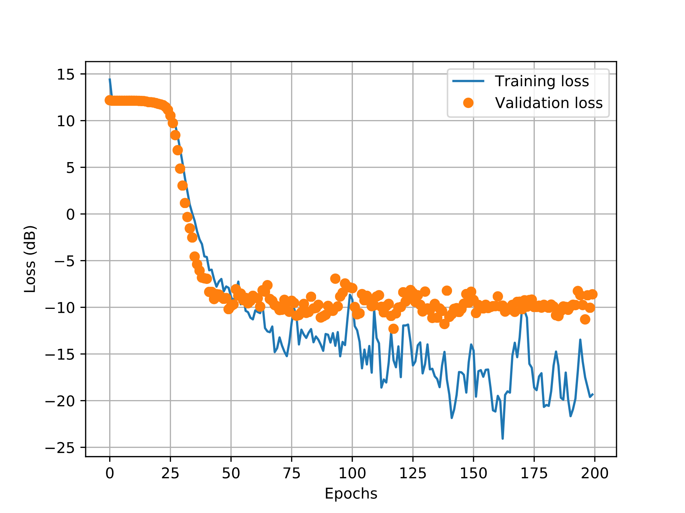

# Handwritten Text Recognition

In this test, I implement a recurrent neural network (RNN) to recognize a sequence of handwritten characters. Unlike the conventional optical character recognition (OCR) approaches, in which each character is recognized separately, requiring therefore a previous step where  the characters are partitioned, with RNN we can retrieve the sequence of characters without explicitly partitioning into character units.

In particular, I use the **Connectionist Temporal Classification (CTC) algorithm**, that jointly computes the loss function and estimates the best alignment between the input sequence and the target label sequence. This algorithm was firstly proposed for speech recognition [1], and subsequently was applied to the handwritten text recognition task [2], and resembles the forward-backward and the Viterbi algorithms used in classical speech recognition tasks.

I implemented the whole process (preprocessing, training and prediction steps) for a simple Captcha reader task (Captcha Cracker database [3]), and still implemented only the preprocessing step for a more sofisticated task in recognizing the IAM dataset [4]. The codes were based on [5-7].

## Sample result

## References

[1] A. Graves, S. Fernandez, F. Gomez and J. Schmidhuber. Connectionist temporal classification: labelling unsegmented sequence data with recurrent neural networks. Proceedings of the 23rd International Conference on Machine Learning (ICML'06), p.369-376, 2006

[2] A. Graves and J. Schmidhuber. Offline handwriting recognition with multidimensional recurrent neural networks. Proceedings of the 21st International Conference on Neural Information Processing Systems (NIPS'08), p.545-552, 2008

[3] https://github.com/AakashKumarNain/CaptchaCracker

[4] IAM database. https://fki.tic.heia-fr.ch/databases/iam-handwriting-database

[5] Keras tutorial. https://keras.io/examples/vision/captcha_ocr/

[6] https://towardsdatascience.com/build-a-handwritten-text-recognition-system-using-tensorflow-2326a3487cd5

[7] https://towardsdatascience.com/faq-build-a-handwritten-text-recognition-system-using-tensorflow-27648fb18519
